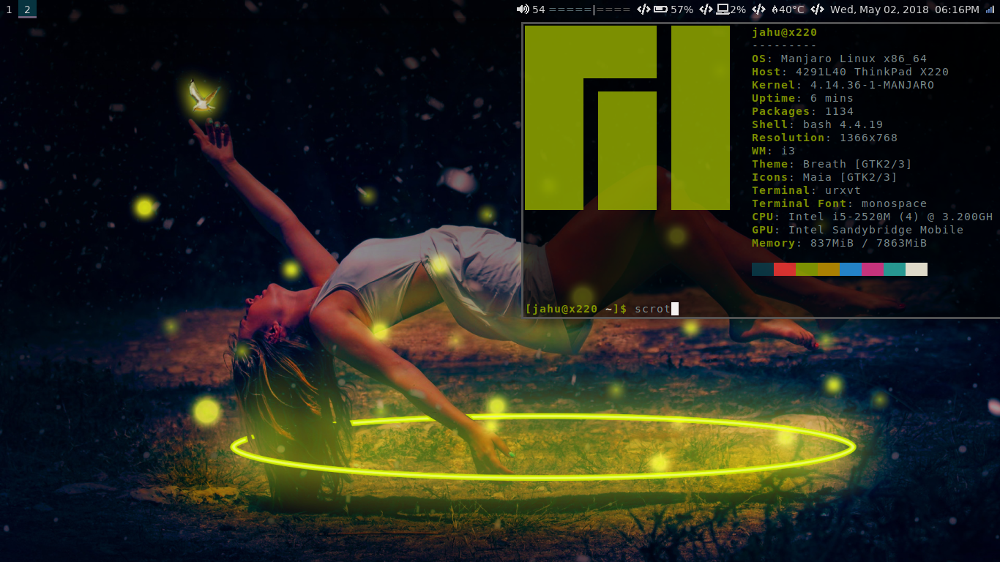

# i3 rice
be kind senpai also here's the [wallpaper](Wallpaper.jpg)

## List of what i use and various packages needed
+ rxvt-unicode
+ i3-gaps
+ polybar-git
+ compton
+ ranger
+ vim
+ Networkmanager + network-manager-applet
+ neofetch
+ nitrogen
+ firefox
+ thunar
+ awesome font pack
+ backlight
+ dunst
+ ++more il add later
